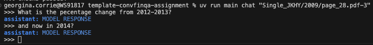

# Conversational Financial QA Agent

A conversational question-answering system for financial documents. ConvFinQA handles multi-turn conversations that require numerical reasoning over financial reports, tracking context across turns to resolve follow-up questions correctly.

## Dataset

This project uses a cleaned version of the ConvFinQA dataset. See `dataset.md` for details on the data format and structure.

## Prerequisites

- Python 3.12+
- [UV environment manager](https://docs.astral.sh/uv/getting-started/installation/)

## Setup

1. Clone this repository
2. Install dependencies with UV:

```bash
# install uv
brew install uv

# set up env
uv sync

# add a python package to the env
uv add <package_name>
```

## Usage

### CLI Chat

A CLI chat interface is included, built with [typer](https://typer.tiangolo.com/) (sister of FastAPI, built on Click). It can be extended to fit your needs.

Run it as an installed script:
```bash
uv run main
```

or in longer form:
```bash
uv run python src/main.py
```

Start a chat session:
```bash
uv run main chat <record_id>
```

[](figures/chat.png)
```
